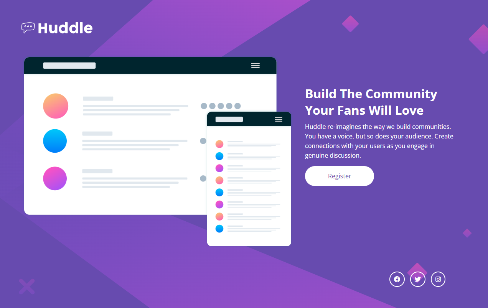

# Huddle Landing Page

Este projeto foi desenvolvido como solução para o desafio **Huddle Landing Page with Single Introductory Section** do Frontend Mentor.

## Descrição do projeto

O Huddle é uma landing page para divulgação de uma plataforma de construção de comunidades. A página apresenta uma seção principal com o mockup da aplicação, um texto de chamada para ação e um botão de registro, além de um rodapé com links para as redes sociais.

Principais características:

- Header com logo e ilustração da aplicação
- Seção de introdução com título, descrição e botão "Register"
- Botão "Register" com mudança de cor ao passar o mouse (hover)
- Ícones de redes sociais no rodapé (Facebook, Twitter e Instagram), também com efeito de hover
- Layout que se adapta a diferentes tamanhos de tela, do mobile ao desktop

## Como visualizar o projeto localmente

1. Clone este repositório ou faça o download dos arquivos.
2. Abra a pasta do projeto no seu editor de código (recomendado: VS Code).
3. Você pode visualizar o projeto de duas formas:
   - Abrindo o arquivo `index.html` diretamente no navegador (dando dois cliques nele ou arrastando para a janela do navegador); ou
   - Usando a extensão **Live Server** do VS Code: clique com o botão direito no arquivo `index.html` e selecione **"Open with Live Server"**.

## Tecnologias utilizadas

- HTML5
- CSS3
- Flexbox
- Responsividade

## Objetivo

Praticar a construção de layouts responsivos utilizando HTML e CSS.

## Autor

Danilo Santos

## Preview

